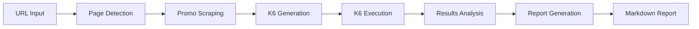

<div align="center">

# 📊 Promo Load Analyzer

### Automated Load Testing for PrestaShop Promotional Campaigns

[](https://www.python.org/downloads/)
[](https://k6.io/)
[](LICENSE)
[](tests/)
[](https://github.com/astral-sh/ruff)

**CLI tool to stress-test your e-commerce promos before Black Friday crashes your servers** 🔥

[Features](#-features) • [Quick Start](#-quick-start) • [Usage](#-usage) • [Documentation](#-documentation) • [Contributing](#-contributing)

</div>

---

## 🎯 What is Promo Load Analyzer?

Promo Load Analyzer is a **zero-configuration CLI tool** that automatically:

1. 🔍 **Detects** your page type (product, category, catalog, homepage)
2. 🛒 **Scrapes** active promotions (striked prices, auto cart rules, manual codes)
3. ⚙️ **Generates** adaptive K6 load test scripts
4. 🚀 **Executes** realistic user scenarios under load
5. 📈 **Analyzes** performance and provides A-F grades
6. 📄 **Reports** actionable recommendations for scaling

**No complex setup. Just point it at a URL and get instant insights.**

### Why This Tool?

PrestaShop promotional campaigns can **kill your server** on Black Friday if not properly tested:
- 🔥 **-15% OFF promos** add 5% server load
- 🎯 **Auto cart rules** add 15% server load
- 💣 **Manual codes** add 25% server load

This tool helps you **validate capacity before going live**.

---

## ✨ Features

### 🔍 Intelligent Detection
- **Automatic page type recognition** (product, category, catalog, homepage)
- **Regex-based URL analysis** with 100% confidence scoring
- **PrestaShop-specific patterns** (1.7.x and 8.x compatible)

### 🛒 Promotion Scraping
- **Striked Price Detection** - CSS-based visual scraping
- **Auto Cart Rules** - JavaScript object extraction from `window.prestashop.cart`
- **Manual Code Detection** - Input field presence checks
- **Playwright-powered** - Handles dynamic content and AJAX

### ⚙️ K6 Load Testing
- **Dynamic script generation** from templates
- **Adaptive intensity levels** (light/medium/heavy)
- **Safety thresholds** with automatic circuit breakers
- **PROD protection** - Time windows, VU limits, read-only mode

### 📊 Performance Analysis
- **A-F Grading System** - Web Vitals-based scoring
- **Capacity Estimation** - Max concurrent users calculation
- **Detailed Metrics** - p95/p99 response times, error rates
- **Complexity Analysis** - Server impact estimation per promo type

### 📄 Reporting
- **Markdown Reports** - Marketing-friendly format
- **Executive Summary** - One-line verdict (Ready/Warning/Critical)
- **Technical Details** - K6 metrics, thresholds, iterations
- **Glossary** - Non-technical explanations for stakeholders

---

## 🚀 Quick Start

### Prerequisites

- **Python 3.11+** - [Download](https://www.python.org/downloads/)
- **K6 0.47+** - [Install K6](https://k6.io/docs/get-started/installation/)
- **macOS/Linux** - Windows support via WSL2

### Installation

```bash
# 1. Clone repository
git clone https://github.com/SymplesSSP/promo-load-analyzer.git
cd promo-load-analyzer

# 2. Create virtual environment
python3 -m venv venv
source venv/bin/activate  # On Windows: venv\Scripts\activate

# 3. Install dependencies
pip install -r requirements.txt

# 4. Install Playwright browsers
playwright install chromium

# 5. Verify installation
python -m src.cli --help
```

### First Test (2 minutes)

```bash
# Test a product page on staging
python -m src.cli \
  "https://recette.ipln.fr/objectif-hybride/1492-sony-lens" \
  --env preprod \
  --intensity light \
  --output report.md
```

**Output:**
```
============================================================
  ANALYSIS COMPLETE
============================================================
  Overall Grade: B
  Score: 88.3/100
  Max Users: ~41

  📄 Full report: report.md
============================================================
```

---

## 📖 Usage

### Basic Commands

```bash
# Quick test on staging
python -m src.cli https://preprod.site.com/promo-page

# Production test (with safety constraints)
python -m src.cli https://prod.site.com/bf2025 --env prod

# Full test with add-to-cart simulation
python -m src.cli https://site.com/product --mode full

# Custom intensity and output
python -m src.cli https://site.com/category \
  --intensity medium \
  --output /tmp/my-report.md
```

### Command-Line Options

| Option | Description | Default | Values |
|--------|-------------|---------|--------|
| `url` | Target URL to test | *required* | Any valid URL |
| `--env` | Environment (safety mode) | `preprod` | `preprod`, `prod` |
| `--intensity` | Test load intensity | `medium` | `light`, `medium`, `heavy` |
| `--mode` | Test mode | `read_only` | `read_only`, `full` |
| `--output` | Report output path | `./report.md` | Any file path |
| `--verbose` | Enable debug logging | `False` | `True`/`False` |

### Intensity Levels

| Intensity | VUs | Duration | Use Case |
|-----------|-----|----------|----------|
| **light** | 50 | 2 min | Quick validation, PROD safe |
| **medium** | 200 | 5 min | Realistic load (default) |
| **heavy** | 500 | 10 min | Stress test (PREPROD only) |

### Test Modes

| Mode | Description | Operations |
|------|-------------|------------|
| **read_only** | Safe browsing only | GET requests, page views |
| **full** | Realistic user behavior | Add to cart, apply promos |

---

## 📊 Report Example

The tool generates a **markdown report** like this:

```markdown
# 📊 ANALYSE DE CHARGE - PROMO LOAD ANALYZER

**URL testée:** https://shop.com/promo-bf2025
**Type de page:** product
**Environnement:** PREPROD
**Date:** 2025-10-27 15:42:37

## 🎯 RÉSUMÉ EXÉCUTIF

🟢 **Bonnes performances - Déploiement recommandé**
⚠️ Les seuils de sécurité K6 ont été dépassés pendant le test

## 📈 SCORES DE PERFORMANCE

| Critère | Valeur | Score | Grade |
|---------|--------|-------|-------|
| **Performance globale** | - | 88.3/100 | **B** 🟢 |
| Temps de réponse (p95) | 1944ms | 80.6/100 | B 🟢 |
| Taux d'erreur | 0.00% | 100.0/100 | A 🟢 |

## 👥 CAPACITÉ SERVEUR

- **Utilisateurs testés:** 50 VUs simultanés
- **Capacité estimée:** ~41 utilisateurs maximum
- **Marge de sécurité:** -9 utilisateurs (-22.0%)

🔴 **Verdict:** Capacité insuffisante - CRITIQUE

## 🏷️ PROMOTIONS DÉTECTÉES

**Nombre de promotions actives:** 1

- **BLACK FRIDAY -15%** - Réduction de 400.00€

**Complexité:** MEDIUM
**Impact serveur estimé:** +15% de charge

## 💡 RECOMMANDATIONS

### 🔴 Priorité HAUTE

- Scale infrastructure before Black Friday (add 20% capacity)
- K6 thresholds exceeded - server degrading under load

### 🟡 Priorité MOYENNE

- 30.8% of checks failed - review cart update logic
```

---

## 🏗️ Architecture

### Project Structure

```
promo-load-analyzer/
├── src/
│   ├── cli.py                  # Click-based CLI interface
│   ├── main.py                 # Main orchestration logic
│   ├── page_detector.py        # URL pattern matching
│   ├── promo_scraper.py        # Playwright-based scraping
│   ├── k6_generator.py         # K6 script generation
│   ├── k6_executor.py          # K6 execution & parsing
│   ├── results_analyzer.py     # Performance scoring
│   ├── report_generator.py     # Markdown report generation
│   ├── models/                 # Pydantic data models
│   │   ├── page_detection.py
│   │   ├── promotion.py
│   │   ├── k6_config.py
│   │   └── k6_results.py
│   └── utils/
│       └── price_parser.py     # Currency & price parsing
├── templates/
│   ├── template_product.js     # K6 template for product pages
│   ├── template_category.js    # K6 template for category pages
│   └── template_homepage.js    # K6 template for homepage
├── tests/
│   ├── unit/                   # 229 unit tests
│   └── integration/            # E2E tests
├── scripts/
│   ├── setup_dev.sh           # Development setup
│   └── check_dependencies.sh   # Dependency validation
└── docs/
    ├── prd.md                  # Product Requirements
    └── architecture.md         # Technical architecture
```

### Technology Stack

| Layer | Technology | Purpose |
|-------|------------|---------|
| **CLI** | Click 8.1+ | Command-line interface |
| **Scraping** | Playwright 1.55+ | Browser automation |
| **Load Testing** | K6 0.47+ | Performance testing |
| **Validation** | Pydantic 2.5+ | Data modeling |
| **Logging** | Loguru 0.7+ | Structured logging |
| **Testing** | Pytest 7.4+ | Unit & integration tests |
| **Linting** | Ruff + Mypy | Code quality |

### Execution Flow



---

## 🧪 Testing

### Run All Tests

```bash
# Run all unit tests (229 tests)
pytest tests/unit/ -v

# Run with coverage
pytest tests/unit/ --cov=src --cov-report=html

# Run integration tests (requires K6)
pytest tests/integration/ -v

# Run specific module tests
pytest tests/unit/test_promo_scraper.py -v
```

### Test Coverage

```bash
# Generate coverage report
pytest tests/unit/ --cov=src --cov-report=term-missing

# View HTML coverage report
open htmlcov/index.html
```

**Current Coverage:** 56% (229/229 tests passing)

### Code Quality

```bash
# Linting
ruff check src/

# Type checking
mypy src/

# Format code
ruff format src/
```

---

## 🛡️ Production Safety

### PROD Mode Constraints

When running with `--env prod`, the following safety mechanisms are **enforced**:

| Constraint | Limit | Rationale |
|------------|-------|-----------|
| **Time Window** | 3h-6h AM only | Minimal traffic window |
| **Max VUs** | 50 concurrent | Avoid Cloudflare rate limiting |
| **Test Mode** | `read_only` | No data modification |
| **Duration** | Max 2 hours | Prevent prolonged load |
| **Thresholds** | Stricter limits | Abort on degradation |

### K6 Safety Thresholds

All K6 scripts include **automatic circuit breakers**:

```javascript
thresholds: {
    'http_req_failed': [{
        threshold: 'rate<0.05',      // Max 5% errors (PROD)
        abortOnFail: true,           // Stop test immediately
        delayAbortEval: '10s'        // After stabilization
    }],
    'http_req_duration': [{
        threshold: 'p(95)<3000',     // p95 < 3s (PROD)
        abortOnFail: true
    }],
}
```

### Emergency Stop

```bash
# Graceful shutdown (exports metrics)
Ctrl+C

# Immediate kill (no export)
Ctrl+C Ctrl+C
```

---

## 📚 Documentation

- **[Product Requirements](docs/prd.md)** - Full PRD with business context
- **[Architecture](docs/architecture.md)** - Technical design & decisions
- **[CLAUDE.md](CLAUDE.md)** - Claude Code AI instructions
- **[Changelog](CHANGELOG.md)** - Release notes & version history

### Additional Resources

- [K6 Documentation](https://k6.io/docs/)
- [Playwright Documentation](https://playwright.dev/)
- [PrestaShop Web Services](https://devdocs.prestashop-project.org/8/webservice/)

---

## 🤝 Contributing

Contributions are welcome! Please follow these guidelines:

### Development Setup

```bash
# 1. Fork and clone
git clone https://github.com/YOUR_USERNAME/promo-load-analyzer.git
cd promo-load-analyzer

# 2. Create branch
git checkout -b feature/my-feature

# 3. Install dev dependencies
pip install -r requirements-dev.txt

# 4. Make changes and test
pytest tests/
ruff check src/
mypy src/

# 5. Commit with conventional commits
git commit -m "feat: add new feature"

# 6. Push and create PR
git push origin feature/my-feature
```

### Commit Convention

We follow [Conventional Commits](https://www.conventionalcommits.org/):

- `feat:` - New feature
- `fix:` - Bug fix
- `docs:` - Documentation changes
- `test:` - Test additions/changes
- `refactor:` - Code refactoring
- `chore:` - Build/tooling changes

### Testing Requirements

- ✅ All existing tests must pass
- ✅ New code must include unit tests
- ✅ Code coverage should not decrease
- ✅ Linting must pass (`ruff check`)
- ✅ Type checking must pass (`mypy`)

---

## 📝 License

This project is licensed under the **MIT License** - see the [LICENSE](LICENSE) file for details.

---

## 🙏 Acknowledgments

- **BMad Method** - Agile methodology used for development
- **Grafana K6** - Excellent load testing tool
- **Microsoft Playwright** - Powerful browser automation
- **PrestaShop** - E-commerce platform support

---

## 📧 Support & Contact

- 🐛 **Issues:** [GitHub Issues](https://github.com/SymplesSSP/promo-load-analyzer/issues)
- 💬 **Discussions:** [GitHub Discussions](https://github.com/SymplesSSP/promo-load-analyzer/discussions)
- 📧 **Email:** support@symplessp.com

---

<div align="center">

**Built with ❤️ by [SymplesSSP](https://github.com/SymplesSSP)**

⭐ **Star this repo if you find it useful!** ⭐

</div>
