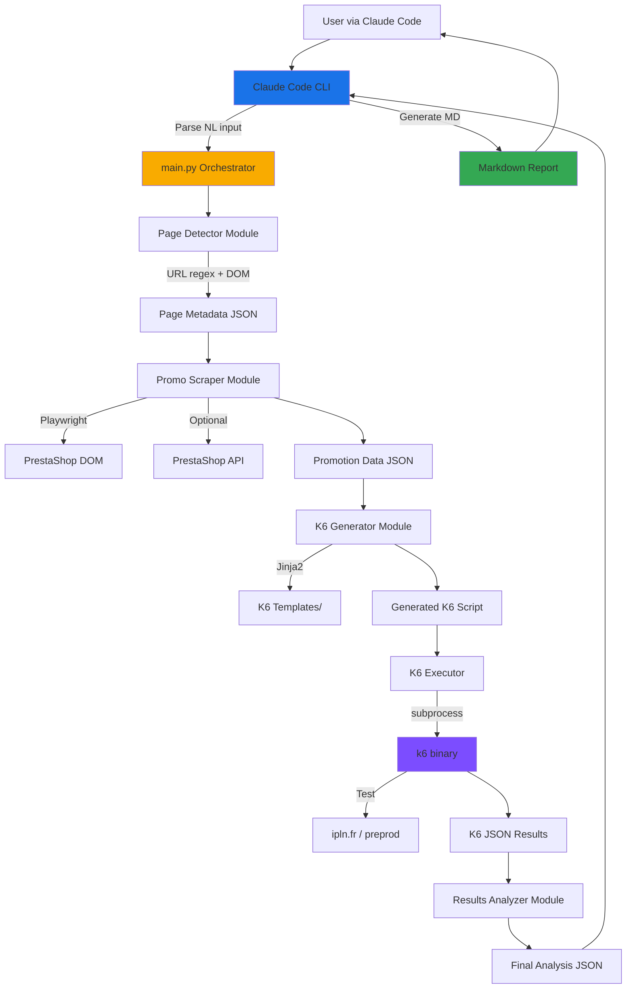

# Promo Load Analyzer Architecture Document

**Version:** 1.0
**Date:** 2025-10-26
**Author:** Winston (Architect)
**Status:** Ready for Review

---

## Introduction

This document outlines the overall project architecture for **Promo Load Analyzer**, including backend systems, shared services, and non-UI specific concerns. Its primary goal is to serve as the guiding architectural blueprint for AI-driven development, ensuring consistency and adherence to chosen patterns and technologies.

**Relationship to Frontend Architecture:**
This project has NO traditional frontend UI. The interface is Claude Code's natural language processing. All user interactions occur through conversational commands. Therefore, no separate Frontend Architecture Document is needed.

### Starter Template or Existing Project

**N/A** - This is a greenfield Python CLI project. No starter template is used. The project will be built from scratch using Python 3.11+ with standard tooling (pip, virtualenv).

### Change Log

| Date | Version | Description | Author |
|------|---------|-------------|--------|
| 2025-10-26 | 1.0 | Initial architecture document | Winston (Architect) |

---

## High Level Architecture

### Technical Summary

The Promo Load Analyzer is a **CLI-based Python monolith** orchestrated by Claude Code for analyzing PrestaShop promotional campaign performance. The system combines web scraping (Playwright), load testing (K6), and intelligent analysis to generate actionable performance reports. It follows a **pipeline architecture pattern** where each component processes data sequentially: URL detection → promotion scraping → K6 script generation → load test execution → results analysis → markdown report generation. The architecture prioritizes **simplicity and speed** to meet the critical Black Friday deadline while implementing robust safety mechanisms to prevent production incidents.

### High Level Overview

**1. Architectural Style:** **Modular Monolith (Pipeline Architecture)**
- Single Python application with clear module boundaries
- Sequential processing pipeline with well-defined interfaces
- No microservices complexity - optimized for 2-week delivery

**2. Repository Structure:** **Single Repository (Monorepo)**
- All Python modules, K6 templates, and docs in one repo
- Simpler dependency management and versioning
- Easier coordination for small team/solo development

**3. Service Architecture:** **Standalone CLI Application**
- Invoked by Claude Code via subprocess execution
- No persistent services or daemons
- Stateless execution (each run is independent)

**4. Primary Data Flow:**
```
User (Claude Code) → main.py → Page Detector → Promo Scraper → K6 Generator
→ K6 Executor → Results Analyzer → JSON Output → Claude Code (Markdown Report)
```

**5. Key Architectural Decisions:**

- **Python CLI vs Web Service:** Chosen CLI for simplicity, no HTTP server needed
- **Synchronous Pipeline:** Sequential execution acceptable (5-10min total)
- **Embedded K6:** Local binary execution for full control and zero cost
- **JSON intermediate format:** Clean separation between analysis and reporting
- **Optional PrestaShop API:** Scraping provides 80% of needed data

### High Level Project Diagram



### Architectural and Design Patterns

- **Pipeline (Pipes and Filters):** Sequential processing stages with clear input/output contracts for easy testing and debugging
- **Dependency Injection (Simple):** Pass dependencies (config, logger) to modules for testability
- **Template Method (K6 Generation):** K6 templates with variable placeholders filled at runtime
- **Strategy Pattern (Environment-Specific Behavior):** Different threshold/VU strategies for PROD vs PREPROD
- **Circuit Breaker (K6 Thresholds):** K6 `abortOnFail` thresholds act as automatic circuit breakers

---

## Tech Stack

### Cloud Infrastructure

- **Provider:** No cloud provider (Local execution)
- **Key Services:** N/A - Standalone CLI tool
- **Deployment Regions:** Local developer machine / CI runner

### Technology Stack Table

| Category | Technology | Version | Purpose | Rationale |
|----------|-----------|---------|---------|-----------|
| **Language** | Python | 3.11+ | Primary development language | Excellent libraries, team expertise, async support, type hints |
| **Runtime** | CPython | 3.11.6 | Python interpreter | Standard, stable, wide compatibility |
| **CLI Framework** | argparse | stdlib | Command-line parsing | Built-in, zero dependencies, sufficient for simple CLI |
| **Web Scraping** | Playwright | 1.40.0 | Browser automation & DOM scraping | Headless browser, JavaScript execution, PrestaShop interaction support |
| **HTTP Client** | requests | 2.31.0 | PrestaShop API calls (optional) | Simple, reliable, widely used |
| **Template Engine** | Jinja2 | 3.1.2 | K6 script generation | Powerful templating, clean syntax, Python standard |
| **Load Testing** | K6 | 0.47+ | Load test execution | Best-in-class, scriptable, threshold support, JSON output |
| **Config Management** | python-dotenv | 1.0.0 | Environment variables | Simple .env file support for API keys |
| **Package Manager** | pip | latest | Dependency management | Python standard, simple requirements.txt |
| **Virtual Env** | venv | stdlib | Isolated dependencies | Built-in, no extra tools needed |
| **Type Checking** | mypy | 1.7.0 | Static type validation | Catches errors early, improves code quality |
| **Linter** | ruff | 0.1.6 | Code linting & formatting | Fast, modern, replaces flake8+black+isort |
| **Testing Framework** | pytest | 7.4.3 | Unit & integration tests | Industry standard, powerful fixtures, parametrization |
| **Test Coverage** | pytest-cov | 4.1.0 | Coverage reporting | Integrates with pytest, clear reports |
| **JSON Validation** | pydantic | 2.5.0 | Data validation & serialization | Type-safe JSON parsing, excellent errors |
| **Logging** | loguru | 0.7.2 | Structured logging | Better than stdlib logging, automatic rotation, colorized |
| **Version Control** | Git | 2.40+ | Source control | Industry standard |
| **CI/CD** | GitHub Actions | N/A (future) | Automated testing (Phase 2) | Free for public repos, YAML config |

---

## Data Models

See detailed Pydantic models in `src/models/`:

- **PageDetectionResult:** Page metadata (type, IDs, elements detected)
- **PromotionData:** Detected promotions with complexity and impact estimates
- **StrikedPriceData:** Striked price details
- **AutoCartRule:** Auto-applied promotional code
- **K6TestConfig:** Configuration for K6 script generation
- **K6Results:** Parsed K6 execution results
- **PerformanceScore:** Calculated scores and grades
- **AnalysisReport:** Final complete report (JSON output)
- **Recommendation:** Actionable recommendation with priority

All models use Pydantic for automatic validation and serialization.

---

## Components

### main.py (Orchestrator)
- CLI entry point and pipeline orchestration
- Validates PROD constraints (time window, VUs)
- Executes sequential pipeline
- Handles exceptions and generates exit codes
- Writes final JSON output

### page_detector.py
- Detects page type via regex patterns or DOM analysis
- Extracts product IDs and metadata
- Uses requests + BeautifulSoup for lightweight parsing

### promo_scraper.py
- Scrapes promotions using Playwright headless browser
- Detects striked prices, auto cart rules, manual code inputs
- Simulates add-to-cart to trigger auto-apply rules
- Calculates complexity (LOW/MEDIUM/HIGH) and server impact

### prestashop_api.py (Optional)
- Enriches cart rule data via PrestaShop Webservice API
- HTTP Basic Auth with API key
- Graceful degradation if API unavailable
- Retry logic with exponential backoff

### k6_generator.py
- Generates K6 JavaScript scripts from Jinja2 templates
- Selects appropriate template based on page type
- Injects test parameters (VUs, duration, thresholds)
- Applies environment-specific thresholds (PROD strict, PREPROD standard)

### k6_executor.py
- Executes K6 binary via subprocess
- Parses NDJSON output
- Detects threshold aborts (exit code 99 = expected, not error)
- Handles K6 not installed gracefully

### results_analyzer.py
- Calculates performance scores (response time + error rate)
- Assigns A-F grades based on web performance standards
- Estimates max concurrent users capacity
- Generates prioritized recommendations

---

## External APIs

### PrestaShop Webservice API (Optional)

- **Purpose:** Enrich promotional rule data with conditions, restrictions, priorities
- **Base URL:** `https://ipln.fr/api` (PROD) | `https://preprod.ipln.fr/api` (PREPROD)
- **Authentication:** HTTP Basic Auth (API Key as username, no password)
- **Key Endpoints:**
  - `GET /api/cart_rules?filter[active]=1` - List active cart rules
  - `GET /api/cart_rules/{id}` - Get cart rule details

**Graceful Degradation:** If API key absent or API fails, continues with scraping data only.

---

## Core Workflows

See detailed sequence diagrams in full architecture document for:

1. **Complete Analysis Pipeline (Happy Path)**
2. **PROD Safety Abort (Threshold Triggered)**
3. **API Enrichment (Optional Path)**
4. **Error Handling - Cloudflare Rate Limit**
5. **Environment Detection & Validation**

---

## Source Tree

```
promo-load-analyzer/
├── .env.example
├── .gitignore
├── README.md
├── requirements.txt
├── requirements-dev.txt
├── pyproject.toml
│
├── src/
│   ├── main.py
│   ├── models/
│   │   ├── page_detection.py
│   │   ├── promotion.py
│   │   ├── k6_config.py
│   │   ├── k6_results.py
│   │   └── analysis_report.py
│   ├── page_detector.py
│   ├── promo_scraper.py
│   ├── prestashop_api.py
│   ├── k6_generator.py
│   ├── k6_executor.py
│   ├── results_analyzer.py
│   ├── config.py
│   ├── constants.py
│   └── utils/
│       ├── logger.py
│       ├── validators.py
│       └── file_utils.py
│
├── templates/
│   ├── base.js.j2
│   ├── template_product.js.j2
│   ├── template_homepage.js.j2
│   ├── template_category.js.j2
│   └── template_landing.js.j2
│
├── tests/
│   ├── conftest.py
│   ├── unit/
│   ├── integration/
│   └── fixtures/
│
├── scripts/
│   ├── check_dependencies.sh
│   ├── setup_dev.sh
│   └── run_tests.sh
│
└── docs/
    ├── prd.md
    ├── architecture.md
    ├── prd/
    ├── architecture/
    ├── epics/
    ├── stories/
    └── qa/
```

---

## Infrastructure and Deployment

### Deployment Strategy

**Manual local installation** - No cloud deployment required.

**Installation process:**
1. Clone repository
2. Run `./scripts/setup_dev.sh` (creates venv, installs deps, checks k6)
3. Configure `.env` (optional for API)
4. Verify: `python src/main.py --help`

**k6 installation:**
- macOS: `brew install k6`
- Linux: See k6.io installation instructions

### Environments

- **Development:** Local machine, PREPROD URLs only
- **Testing:** Local machine, integration tests against PREPROD
- **Production Use:** Local machine, testing against PROD (with time/VU restrictions)

### Rollback Strategy

- **Method:** Git revert commit
- **RTO:** Immediate (revert + re-run)
- No deployment rollback needed (local tool)

### Monitoring

- **Logging:** Loguru with daily rotation, correlation IDs for tracing
- **Metrics:** Embedded in JSON output (execution times, success rates)
- **Phase 2:** Slack notifications, structured logging export

---

## Error Handling Strategy

### Exception Hierarchy

```
PromoAnalyzerException (base)
├── ValidationError (user input, PROD constraints)
├── DetectionError (page/promo detection failures)
├── ScrapingError (Playwright/network issues)
├── K6ExecutionError (K6 binary, script execution)
├── APIError (PrestaShop API failures)
└── AnalysisError (results parsing, scoring)
```

### Logging Standards

- **Library:** Loguru 0.7.2
- **Format:** Timestamp | Level | Module:Function:Line | Message
- **Correlation ID:** Generated per execution for full traceability
- **Levels:** DEBUG, INFO, WARNING, ERROR, CRITICAL
- **Restrictions:** NEVER log API keys, auth tokens, PII, sensitive data

### Error Handling Patterns

**External API Errors:**
- Retry policy: Max 2 retries, exponential backoff (1s, 2s)
- Timeout: 15s total per request
- Graceful degradation on failure (continue without enrichment)

**Playwright Scraping:**
- Retry: Max 2 retries on timeout/network errors
- Timeout: 30s page load, 60s total per page
- Partial results on failure

**K6 Execution:**
- Exit code 99 = threshold abort (expected, not error)
- Timeout: 10min max
- Detect K6 not installed with clear error message

### Critical Rules

1. NEVER log sensitive data (API keys, credentials, PII)
2. ALWAYS validate PROD constraints before K6 execution
3. ALWAYS close resources in finally blocks
4. ALWAYS wrap K6 subprocess with timeout
5. NEVER suppress exceptions silently

---

## Coding Standards

### Core Standards

- **Python 3.11+ required** (modern features: match/case, improved type hints)
- **Ruff** for linting + formatting (max line length: 100)
- **mypy** strict mode (all functions must have type hints)
- **pytest** for testing (≥80% coverage for core modules)

### Critical Rules (MANDATORY)

1. **NEVER hardcode URLs or credentials** - Use config/env
2. **ALWAYS validate PROD constraints before K6** - Safety critical
3. **ALWAYS use Pydantic models for data transfer** - Type safety
4. **NEVER suppress K6 threshold aborts as errors** - Exit 99 = expected
5. **ALWAYS close browser/resources in finally blocks**
6. **ALWAYS use correlation_id for traceability**
7. **NEVER log sensitive data** - Sanitize logs
8. **ALWAYS use pathlib.Path for files** - Cross-platform
9. **ALWAYS set timeouts for external operations** - Prevent hangs
10. **Use Loguru logger, never print()** - Except CLI output
11. **K6 templates must include safety thresholds** - REQUIRED
12. **Async functions use proper Playwright async API**

### Python 3.11+ Specifics

- Use Pydantic v2 validation
- Use match/case for cleaner conditionals
- Use native union types (`str | None` not `Union`)
- Type hints everywhere

---

## Test Strategy

### Testing Philosophy

- **Approach:** TDD encouraged but not mandatory for MVP
- **Coverage Goals:** ≥80% for core modules, ≥70% overall
- **Test Pyramid:** 70% unit, 25% integration, 5% E2E

### Test Types

**Unit Tests:**
- Framework: pytest
- Location: `tests/unit/`
- Mock all external dependencies
- Fast execution (< 1s total)

**Integration Tests:**
- Location: `tests/integration/`
- Real dependencies (k6 binary, Playwright, PREPROD network)
- Skip if dependencies missing

**E2E Tests:**
- Full pipeline execution
- PREPROD only
- Expensive, run on-demand

### Test Organization

- Test files: `test_<module>.py`
- Test functions: `test_<function>_<scenario>`
- Fixtures in `tests/conftest.py`
- AAA pattern (Arrange, Act, Assert)

---

## Security

### Input Validation

- **Library:** Pydantic 2.5.0 (automatic validation)
- **Location:** At API boundary (main.py + model constructors)
- **Rules:** All external inputs validated, whitelist approach, fail-fast

### Authentication & Authorization

- **User Auth:** None (local CLI tool)
- **API Auth:** HTTP Basic Auth with API key from `.env`
- **API keys:** Never hardcoded, stored in `.env` (gitignored)

### Secrets Management

- **Development:** `.env` file (gitignored)
- **Production:** `.env` file (manually configured per user)
- **Requirements:**
  - NEVER hardcode secrets
  - Access via Config.get_api_key()
  - No secrets in logs, errors, or JSON outputs

### HTTPS Enforcement

- All HTTP requests use HTTPS only
- SSL certificate verification enabled (`verify=True`)
- Reject HTTP URLs in validation

### Logging Restrictions

**NEVER log:**
- API keys, auth tokens
- Full API responses (may contain sensitive business data)
- Complete K6 results (may contain response bodies)
- Environment variables

**Safe to log:**
- URLs (sanitized, no query params)
- HTTP status codes
- Aggregated metrics
- Execution flow
- Error types (not sensitive details)

### Dependency Security

- **Tool:** pip-audit (manual scans)
- **Policy:** Review advisories monthly, update quarterly
- **Approval:** New dependencies require CVE check and maintenance verification

### Threat Model

**Critical mitigations:**
- PROD overload prevention: Time window + VU limits + K6 thresholds
- API key leaks: Sanitize logs, gitignore .env
- MITM attacks: HTTPS only + certificate verification

---

## Next Steps

### For Product Owner
1. Review this architecture document
2. Run master checklist to validate alignment with PRD
3. Approve or request changes
4. Proceed with story implementation once approved

### For Development Team
1. Setup development environment (`./scripts/setup_dev.sh`)
2. Begin implementation following architecture and coding standards
3. Start with core modules (page_detector, k6_generator, results_analyzer)
4. Write unit tests alongside development (TDD encouraged)
5. Integration test on PREPROD frequently

### Implementation Priority

**Phase 1 - MVP (< 2 weeks):**
1. Page detection (regex patterns)
2. Basic promo scraping (Playwright)
3. K6 script generation with safety thresholds
4. K6 execution and results parsing
5. Scoring and recommendation engine
6. PROD safety validation
7. End-to-end testing on PREPROD

**Phase 2 - Post Black Friday:**
- Real-time dashboard (InfluxDB + Grafana)
- Automated testing (GitHub Actions CI/CD)
- Enhanced analytics
- Performance optimizations

---

*Generated by Winston (Architect) - 2025-10-26*
