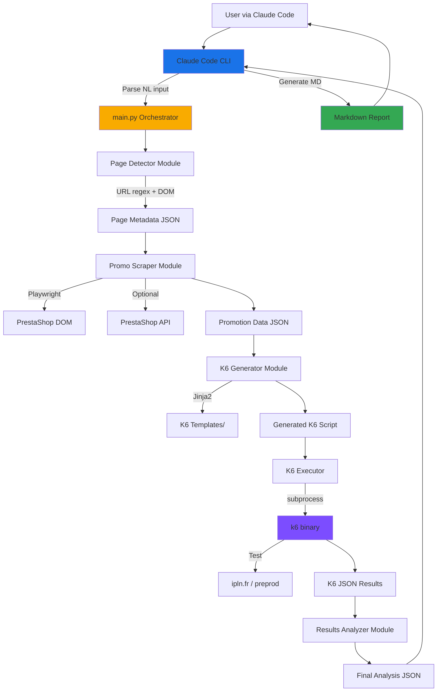

# High Level Architecture

## Technical Summary

The Promo Load Analyzer is a **CLI-based Python monolith** orchestrated by Claude Code for analyzing PrestaShop promotional campaign performance. The system combines web scraping (Playwright), load testing (K6), and intelligent analysis to generate actionable performance reports. It follows a **pipeline architecture pattern** where each component processes data sequentially: URL detection → promotion scraping → K6 script generation → load test execution → results analysis → markdown report generation. The architecture prioritizes **simplicity and speed** to meet the critical Black Friday deadline while implementing robust safety mechanisms to prevent production incidents.

## High Level Overview

**1. Architectural Style:** **Modular Monolith (Pipeline Architecture)**
- Single Python application with clear module boundaries
- Sequential processing pipeline with well-defined interfaces
- No microservices complexity - optimized for 2-week delivery

**2. Repository Structure:** **Single Repository (Monorepo)**
- All Python modules, K6 templates, and docs in one repo
- Simpler dependency management and versioning
- Easier coordination for small team/solo development

**3. Service Architecture:** **Standalone CLI Application**
- Invoked by Claude Code via subprocess execution
- No persistent services or daemons
- Stateless execution (each run is independent)

**4. Primary Data Flow:**
```
User (Claude Code) → main.py → Page Detector → Promo Scraper → K6 Generator
→ K6 Executor → Results Analyzer → JSON Output → Claude Code (Markdown Report)
```

**5. Key Architectural Decisions:**

- **Python CLI vs Web Service:** Chosen CLI for simplicity, no HTTP server needed
- **Synchronous Pipeline:** Sequential execution acceptable (5-10min total)
- **Embedded K6:** Local binary execution for full control and zero cost
- **JSON intermediate format:** Clean separation between analysis and reporting
- **Optional PrestaShop API:** Scraping provides 80% of needed data

## High Level Project Diagram



## Architectural and Design Patterns

- **Pipeline (Pipes and Filters):** Sequential processing stages with clear input/output contracts for easy testing and debugging
- **Dependency Injection (Simple):** Pass dependencies (config, logger) to modules for testability
- **Template Method (K6 Generation):** K6 templates with variable placeholders filled at runtime
- **Strategy Pattern (Environment-Specific Behavior):** Different threshold/VU strategies for PROD vs PREPROD
- **Circuit Breaker (K6 Thresholds):** K6 `abortOnFail` thresholds act as automatic circuit breakers

---
